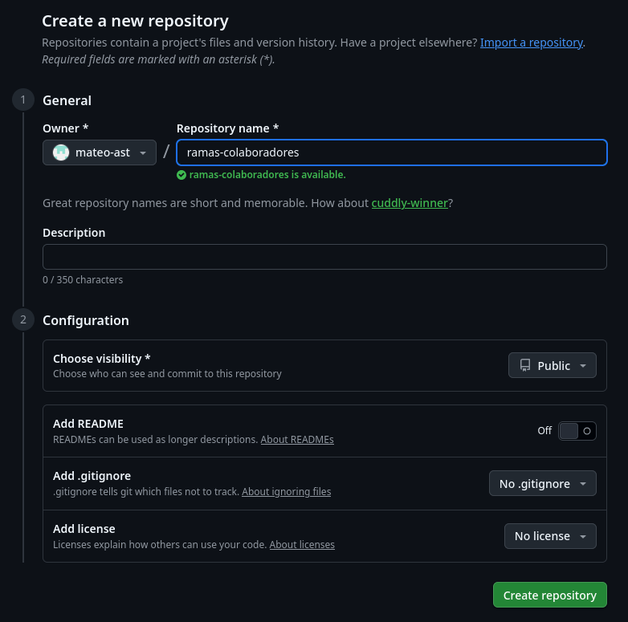
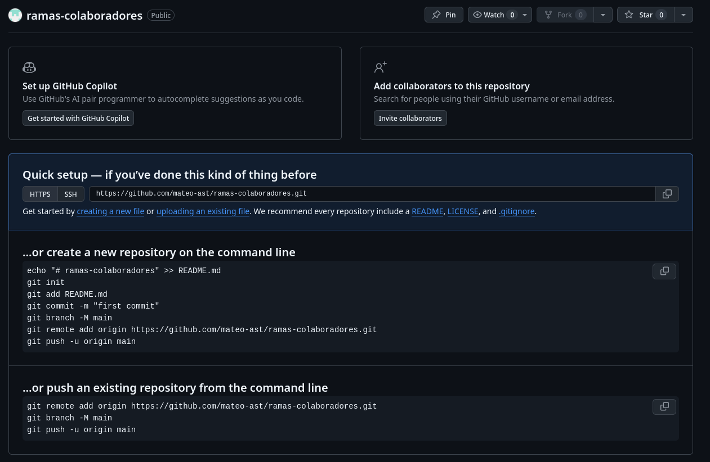
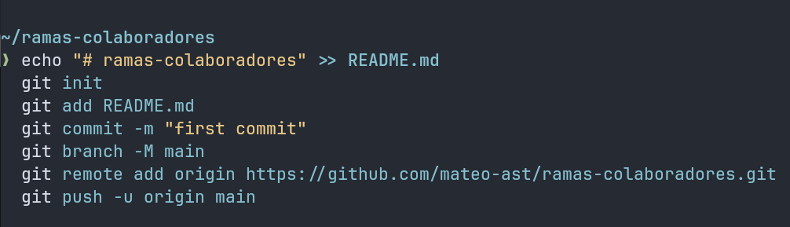
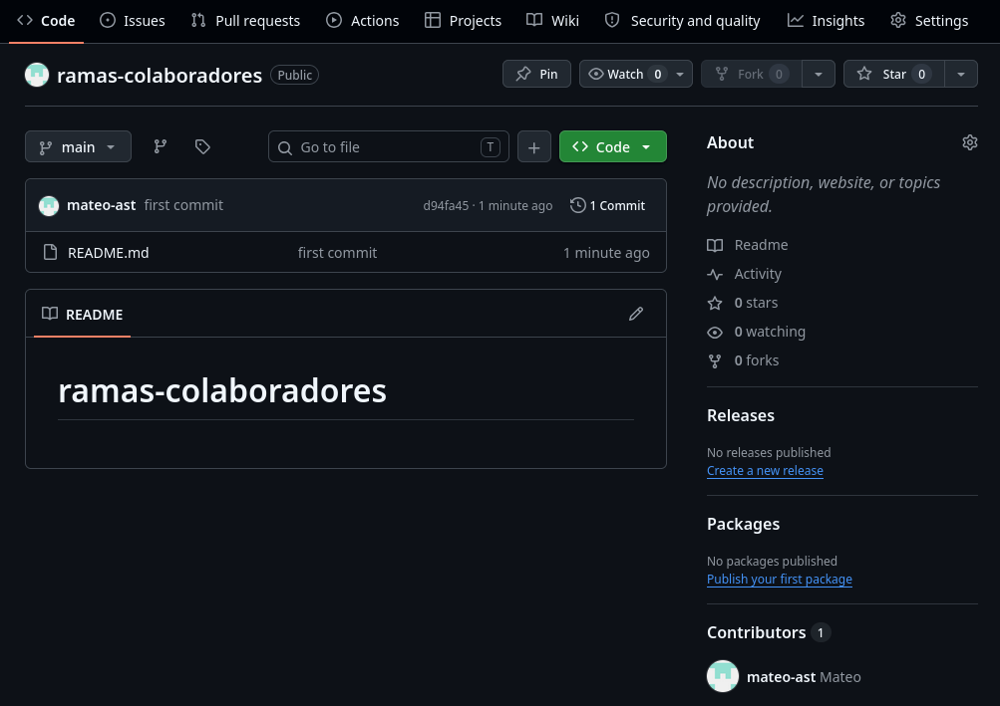

# Guía: Crear un Repositorio y Agregar Colaboradores en GitHub

## 1. Crear el repositorio en GitHub

1. En la página principal de GitHub, haz clic en el botón verde **New** (Nuevo).

2. Completa el formulario:
   - Ingresa un **Repository name** (por ejemplo, `ramas-colaboradores`).
   - Elige si será Público o Privado.
   - Haz clic en el botón verde **Create repository** (Crear repositorio) al final de la página.

## 2. Vincular y subir tu código local

## 3. Invitar a un colaborador

En la página de tu repositorio en GitHub, ve a la pestaña superior derecha que dice Settings (Configuración).

En el menú lateral izquierdo, haz clic en Collaborators (Colaboradores).

Haz clic en el botón Add people (Agregar personas).

Busca al colaborador por su nombre de usuario de GitHub o su correo electrónico (ej. pablo).

Selecciónalo en la lista y haz clic en Add to repository.

Nota: El colaborador recibirá un correo electrónico con una invitación. Deberá aceptarla para tener permisos de escritura (push) en el repositorio.
